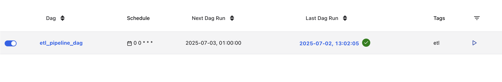
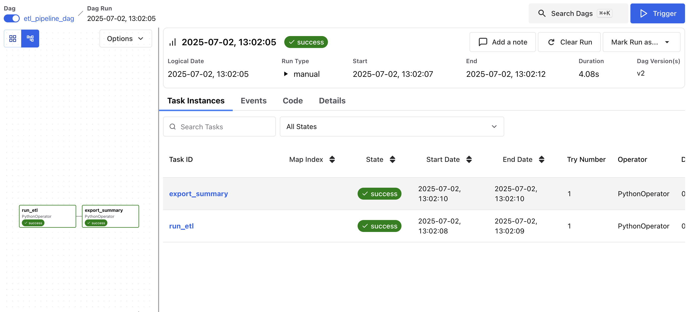

# Fake ETL Pipeline: Pandas Skills Reinforcement

## 1. Overview

This mini project simulates an end‑to‑end data engineering pipeline using synthetic data. It is designed to reinforce skill using Pandas for:

* **Data cleaning**: stripping whitespace, handling missing values (`dropna`, `fillna`).
* **Data transformation & reshaping**: pivot tables (`pivot_table`), unpivoting (`melt`).
* **Type conversion & validation**: numeric coercion (`pd.to_numeric`), date parsing.

## 2. Data Files

All raw and intermediate data live under `raw_data/` and `cleaned/`. Final outputs are in `output_summary/`.

### 2.1 Raw Data (`raw_data/`)

* `users.csv`: synthetic user profiles (user\_id, name, signup\_date)
* `transactions.csv`: synthetic transaction log (txn\_id, user\_id, amount, timestamp)
* `data.json`: combined synthetic user and transaction JSON

### 2.2 Cleaned Data (`cleaned/`)

* `users_clean.csv`
* `transactions_clean.csv`
* `master.csv`: merged users + transactions
* `master.json`: merged data in JSON format

### 2.3 Final Outputs (`output_summary/`)

* `user_monthly_spend.csv`: wide pivot of monthly spend per user
* `user_monthly_spend_long.csv`: long form of the monthly spend summary
* `weekly_revenue.csv`: weekly revenue totals across all users
* `users_no_txn.csv` : users with no recorded transactions

## 3. Requirements

```bash
pip install pandas
```

## 4. Usage

1. Open the Jupyter notebook `etl_challenge.ipynb`.
2. Run each cell sequentially to: load raw CSVs, clean, merge, reshape, and export.
3. All outputs will be generated under the `cleaned/` and `output_summary/` folders.

## 5. Project Structure

```
ETL_PIPELINE/
├── .gitignore
├── README.md
├── etl_challenge.ipynb
├── etl_pipeline.db  # exclued via .gitignore
├── sql_analysis.ipynb
│
├── airflow/
│   ├── .env                 # Environment variables for Docker Compose (AIRFLOW_UID)
│   ├── docker-compose.yaml  # Sets up Airflow services (scheduler, webserver, etc.)
│   ├── config/              # Created manually; can store airflow.cfg or templates
│   ├── dags/                # DAG and pipeline scripts (etl_dag.py, etl_pipeline.py)
│   ├── logs/                # Created manually; Airflow writes logs here
│   ├── output/ 
│   │   ├── cleaned/         # Contains master.json (ETL result)
│   │   └── summary/         # Query results from DAG tasks
│   └── plugins/             # Optional custom plugins (empty or with hooks/operators)
│
├── cleaned/                 # Output generated by notebook (excluded via .gitignore)
├── output_summary/          # Final summary CSVs (excluded via .gitignore)
├── raw_data/
│   ├── transactions.csv
│   ├── users.csv
│   └── data.json
```

## 6. DAG Orchestration with Airflow

Airflow setup to automate the ETL pipeline.

**Setup Instructions:**

1. Navigate to `airflow/`

2. Create required folders:

```bash
mkdir -p logs plugins config 
```

3. Add environment variable file:

```bash
echo -e "AIRFLOW_UID=$(id -u)" > .env
```

4. Start Airflow:

```bash
docker-compose up -d
```

5. Access Airflow UI at `http://localhost:8080`

DAG tasks execute ETL steps such as loading raw files, cleaning with Pandas, merging datasets, writing cleaned outputs to `airflow/output/`.

## 7. Airflow DAG Visualization

Below are screenshots showing the DAG scheduled to run daily and executing successfully via manual trigger in the Airflow UI:

### ✅ DAG Schedule View


### ✅ DAG Run Success


